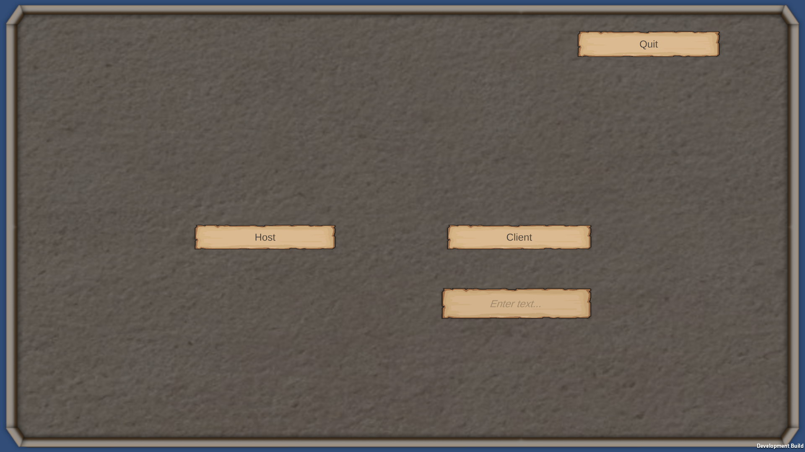
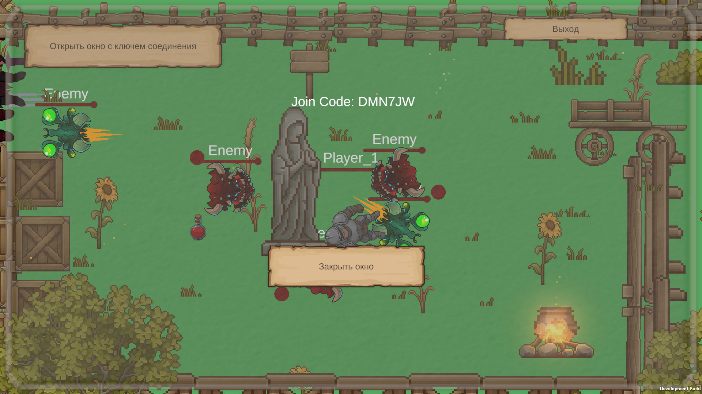
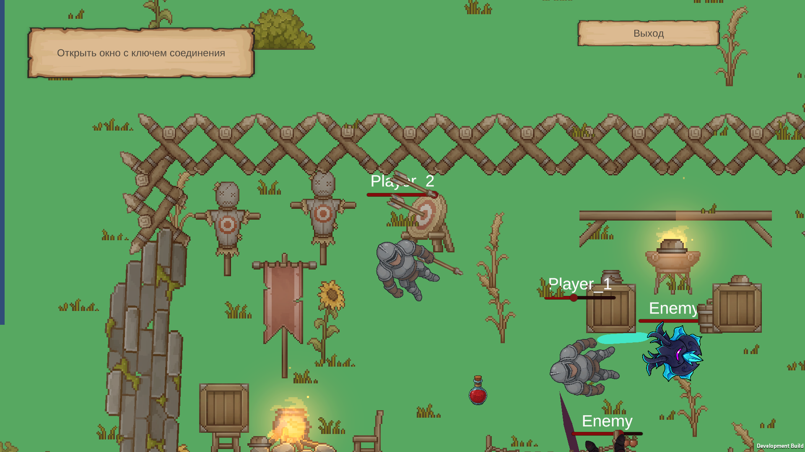
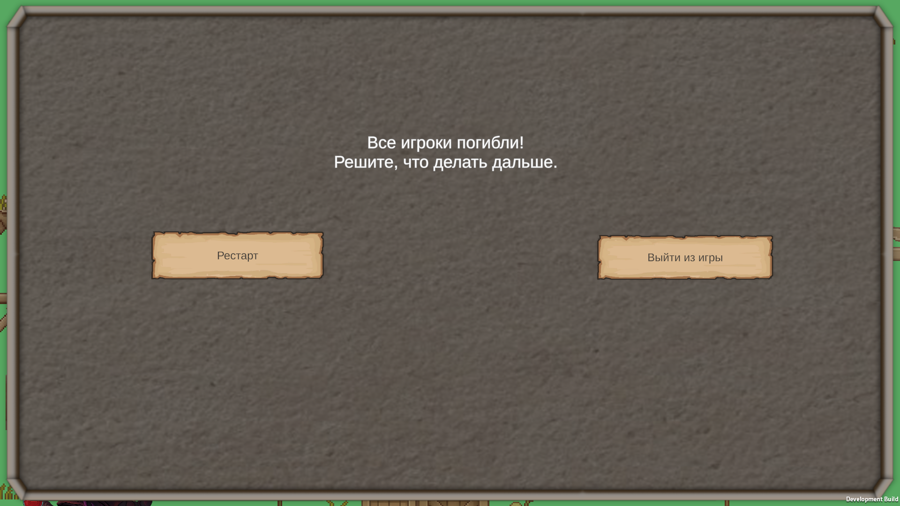
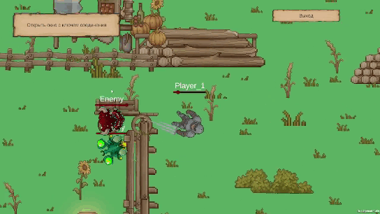
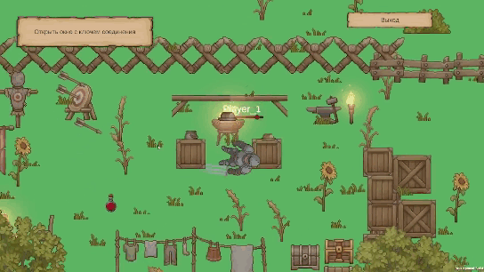

# ActionRPGMultiplayNGO
Мультиплеерная 2д игра с видом сверху. Использует Netcode for GameObjects для сетевого взаимодействия между клиентом и хостом. Цель игры пройти по авто сгенерированной локации и уничтожить босса. Главной целью при разработке было сделать рабочий прототип с корректно работающими сетевым кодом, синхронизаций игроков, состояний и противников. Визуал создан за счет бесплатных ассетов в минимальном состоянии для тестирования и визуализации общего видения игры.

# Геймплей
- У игрока 2 оружия, которые он может переключать по ходу игры на клавиши 1 и 2. Оружие реализовано, таким образом, чтобы сохранялся второй принцип SOLID открытости-закрытости. Добавление нового оружия не требует изменения существующей системы его использования как у игрока, так и у противников. Это реализовано через интерфейс IWeapon и реализующий его класс оружия Weapon. Игрок и противники имеют свой менеджер что позволяет использовать оружие.
- Генерация локации происходит из заготовленных комнат и позволяет из инспектора задать колличество комнат и то, как часто могут повторятся комнаты подряд. В scriptable object хранится информация о всех комнатах, их сокетах для соединения с другими, является ли комната закрывающей. После генерации комнаты она начинает спавнить объекты, что должны быть на ней. Обычно это монстры, разрушаемые объекты и усилители.
- В игре реализована система power up позволяющая исцелять игрока или ускорять его движение за счет зелий, что появляются на локации. Есть базовый класс от которого наследуются все возмозможные усилители.
- В игре присутствует урон по своим. Это касается не только монстров, но и игроков. Этим тожно пользоаться, чтобы сражаться с толпой врагов, застовляя их попадать друг другу атакуя игрока.

# Netcode
- Игра работает по принципу хост\клиент. В проекте 2 сцены. На первой происходит запуск игры и выбор зайти как хост или клиент. Если заходишь как хост, то при запуске игровой сцены появится код для подсоединения к тебе других игроков. Его нужно передать клиенту и он в первой сцене введет этот 6 значный код для подсоединения к хосту. Весь игровой процесс происходит на 2 сцене на которой хост видит код и к которой присоеденяетя клиент.
- Для того чтобы игра создавала соединение она подключена к Unity Cloud. Проект зарегистрирован в Unity Dashboard, так же поставлены Unity Relay, Unity Lobby, Authentication.
- При смерти всех игроков клиенты ждут решения хоста, хост выберает рестартнуть игру или выйти из нее. Каждый игрок может выйти из игры в любой момент. Если игрок погиб, но есть те за кем можно наблюдать, то камера переключится на живого игрока и погибший игрок сможет на tab переключаться между другими живыми игроками.

# Скриншоты и геймплей
 
 

 

 

# Запуск проекта
- В папке Build есть скомпилированная версия приложения пригодная для тестирования
